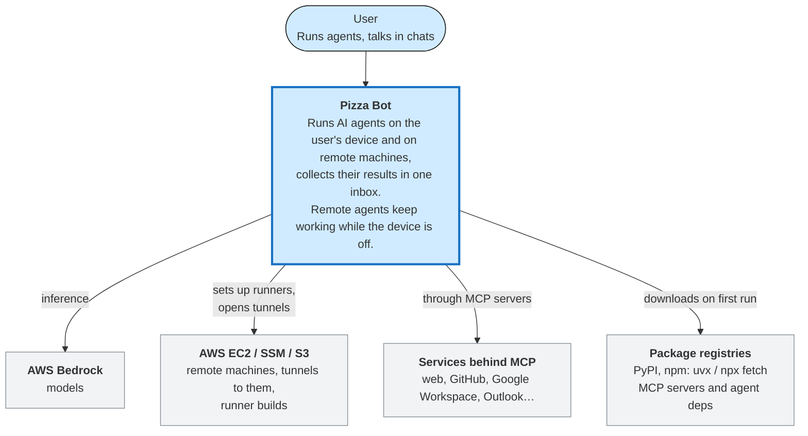

# C1 · System context

The fleet as one system: who uses it and what it depends on outside itself.

```mermaid
flowchart TB
  user(["User<br/>Runs agents, talks in chats"])

  system["<b>Pizza Bot</b><br/>Runs AI agents on the user's device and on remote machines,<br/>collects their results in one inbox.<br/>Remote agents keep working while the device is off."]

  bedrock["<b>AWS Bedrock</b><br/>models"]
  aws["<b>AWS EC2 / SSM / S3</b><br/>remote machines, tunnels to them,<br/>runner builds"]
  services["<b>Services behind MCP</b><br/>web, GitHub, Google Workspace, Outlook…"]
  registries["<b>Package registries</b><br/>PyPI, npm: uvx / npx fetch<br/>MCP servers and agent deps"]

  user --> system
  system -- inference --> bedrock
  system -- "sets up runners,<br/>opens tunnels" --> aws
  system -- through MCP servers --> services
  system -- downloads on first run --> registries

  classDef person fill:#d0ebff,stroke:#1e1e1e
  classDef ours fill:#d0ebff,stroke:#1971c2,stroke-width:3px
  classDef external fill:#f1f3f5,stroke:#868e96
  class user person
  class system ours
  class bedrock,aws,services,registries external
```
