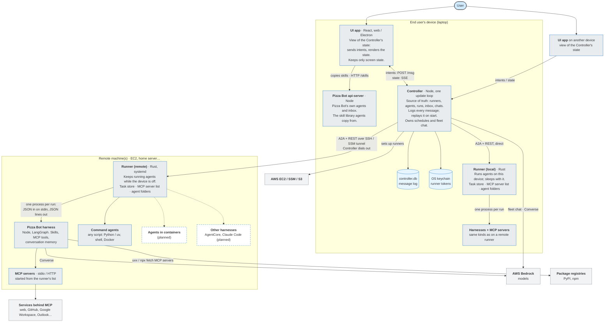

# C2 · Containers

What runs where, and how the pieces talk. The Controller always dials out; runners never call it.

```mermaid
flowchart TB
  user(["User"])
  remoteUi["<b>UI app</b> on another device<br/>view of the Controller's state"]

  subgraph laptop["End user's device (laptop)"]
    ui["<b>UI app</b> · React, web / Electron<br/>View of the Controller's state:<br/>sends intents, renders the state.<br/>Keeps only screen state."]
    api["<b>Pizza Bot api-server</b> · Node<br/>Pizza Bot's own agents and inbox.<br/>The skill library agents copy from."]
    controller["<b>Controller</b> · Node, one update loop<br/>Source of truth: runners, agents, runs, inbox, chats.<br/>Logs every message; replays it on start.<br/>Owns schedules and fleet chat."]
    log[("controller.db<br/>message log")]
    keychain[("OS keychain<br/>runner tokens")]
    localRunner["<b>Runner (local)</b> · Rust<br/>Runs agents on this device; sleeps with it.<br/>Task store · MCP server list · agent folders"]
    localAgents["<b>Harnesses + MCP servers</b><br/>same kinds as on a remote runner"]
  end

  subgraph remote["Remote machine(s) · EC2, home server…"]
    remoteRunner["<b>Runner (remote)</b> · Rust, systemd<br/>Keeps running agents while the device is off.<br/>Task store · MCP server list · agent folders"]
    pizzaHarness["<b>Pizza Bot harness</b><br/>Node, LangGraph. Skills, MCP tools,<br/>conversation memory"]
    commandAgents["<b>Command agents</b><br/>any script: Python / uv, shell, Docker"]
    containers["<b>Agents in containers</b><br/>(planned)"]
    otherHarnesses["<b>Other harnesses</b><br/>AgentCore, Claude Code (planned)"]
    mcp["<b>MCP servers</b> · stdio / HTTP<br/>started from the runner's list"]
  end

  bedrock["<b>AWS Bedrock</b><br/>models"]
  aws["<b>AWS EC2 / SSM / S3</b>"]
  registries["<b>Package registries</b><br/>PyPI, npm"]
  services["<b>Services behind MCP</b><br/>web, GitHub, Google Workspace, Outlook…"]

  user --> ui
  user --> remoteUi
  ui -- copies skills · HTTP /skills --> api
  ui <-- "intents: POST /msg<br/>state: SSE" --> controller
  remoteUi -- intents / state --> controller
  controller --> log
  controller --> keychain
  controller -- A2A + REST, direct --> localRunner
  localRunner -- one process per run --> localAgents
  controller -- "A2A + REST over SSH / SSM tunnel<br/>Controller dials out" --> remoteRunner
  controller -- fleet chat · Converse --> bedrock
  controller -- sets up runners --> aws
  remoteRunner -- "one process per run:<br/>JSON in on stdin, JSON lines out" --> pizzaHarness
  remoteRunner --> commandAgents
  remoteRunner -.-> containers
  remoteRunner -.-> otherHarnesses
  pizzaHarness --> mcp
  pizzaHarness -- Converse --> bedrock
  pizzaHarness -- uvx / npx fetch MCP servers --> registries
  mcp --> services

  classDef person fill:#d0ebff,stroke:#1e1e1e
  classDef ours fill:#e9ecef,stroke:#1971c2
  classDef planned fill:#ffffff,stroke:#1971c2,stroke-dasharray:6 4
  classDef store fill:#e7f5ff,stroke:#1971c2
  classDef external fill:#f1f3f5,stroke:#868e96
  class user person
  class ui,remoteUi,api,controller,localRunner,localAgents,remoteRunner,pizzaHarness,commandAgents,mcp ours
  class containers,otherHarnesses planned
  class log,keychain store
  class bedrock,aws,registries,services external
```
