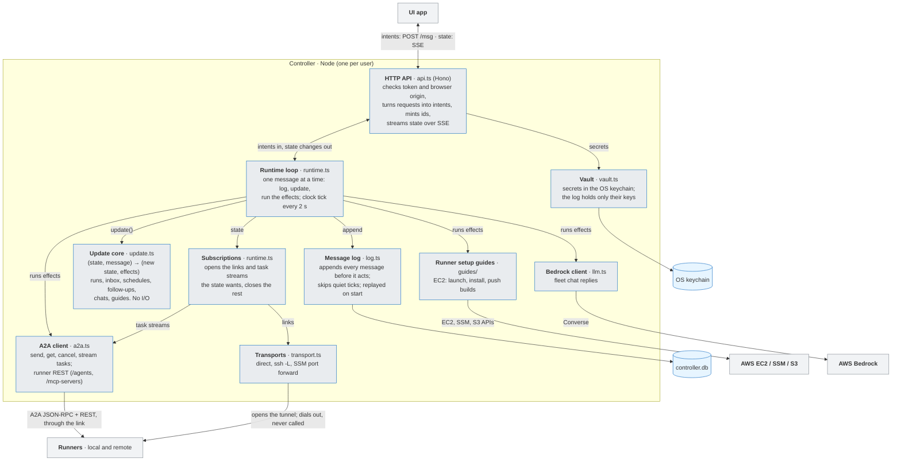

# C3 · Controller

The parts of the Controller (`experimental/fleet/controller/src`). Only the update core decides; everything
else either feeds it messages or carries out the effects it returns.

```mermaid
flowchart TB
  ui["<b>UI app</b>"]

  subgraph controller["Controller · Node (one per user)"]
    vault["<b>Vault</b> · vault.ts<br/>secrets in the OS keychain;<br/>the log holds only their keys"]
    http["<b>HTTP API</b> · api.ts (Hono)<br/>checks token and browser origin,<br/>turns requests into intents, mints ids,<br/>streams state over SSE"]
    msglog["<b>Message log</b> · log.ts<br/>appends every message before it acts;<br/>skips quiet ticks; replayed on start"]
    core["<b>Update core</b> · update.ts<br/>(state, message) → (new state, effects)<br/>runs, inbox, schedules, follow-ups,<br/>chats, guides. No I/O"]
    runtime["<b>Runtime loop</b> · runtime.ts<br/>one message at a time: log, update,<br/>run the effects; clock tick every 2 s"]
    subs["<b>Subscriptions</b> · runtime.ts<br/>opens the links and task streams<br/>the state wants, closes the rest"]
    guides["<b>Runner setup guides</b> · guides/<br/>EC2: launch, install, push builds"]
    llm["<b>Bedrock client</b> · llm.ts<br/>fleet chat replies"]
    a2a["<b>A2A client</b> · a2a.ts<br/>send, get, cancel, stream tasks;<br/>runner REST (/agents, /mcp-servers)"]
    transports["<b>Transports</b> · transport.ts<br/>direct, ssh -L, SSM port forward"]
  end

  keychain[("OS keychain")]
  db[("controller.db")]
  aws["<b>AWS EC2 / SSM / S3</b>"]
  bedrock["<b>AWS Bedrock</b>"]
  runners["<b>Runners</b> · local and remote"]

  ui <-- "intents: POST /msg · state: SSE" --> http
  http -- secrets --> vault
  http <-- "intents in, state changes out" --> runtime
  runtime -- append --> msglog
  runtime -- "update()" --> core
  runtime -- state --> subs
  runtime -- runs effects --> guides
  runtime -- runs effects --> llm
  runtime -- runs effects --> a2a
  subs -- task streams --> a2a
  subs -- links --> transports
  vault --> keychain
  msglog --> db
  guides -- EC2, SSM, S3 APIs --> aws
  llm -- Converse --> bedrock
  a2a -- "A2A JSON-RPC + REST, through the link" --> runners
  transports -- "opens the tunnel; dials out, never called" --> runners

  classDef ours fill:#e9ecef,stroke:#1971c2
  classDef store fill:#e7f5ff,stroke:#1971c2
  classDef external fill:#f1f3f5,stroke:#868e96
  class vault,http,msglog,core,runtime,subs,guides,llm,a2a,transports ours
  class keychain,db store
  class ui,aws,bedrock,runners external
```
