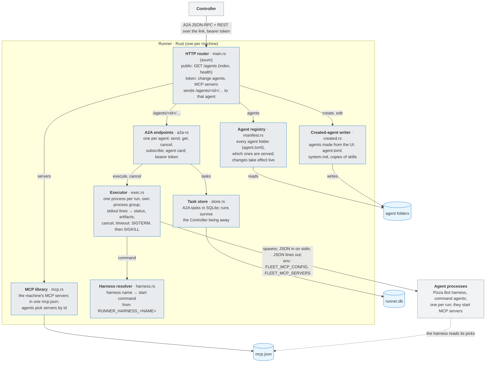

# C3 · Runner

The parts of a runner (`experimental/fleet/runner/src`), one per machine. It hosts agents and never
calls the Controller; the Controller reaches it over a link it opens.

```mermaid
flowchart TB
  controller["<b>Controller</b>"]

  subgraph runner["Runner · Rust (one per machine)"]
    mcplib["<b>MCP library</b> · mcp.rs<br/>the machine's MCP servers in one mcp.json;<br/>agents pick servers by id"]
    router["<b>HTTP router</b> · main.rs (axum)<br/>public: GET /agents (index, health)<br/>token: change agents, MCP servers<br/>sends /agents/&lt;id&gt;/… to that agent"]
    registry["<b>Agent registry</b> · manifest.rs<br/>every agent folder (agent.toml),<br/>which ones are served;<br/>changes take effect live"]
    resolver["<b>Harness resolver</b> · harness.rs<br/>harness name → start command<br/>from RUNNER_HARNESS_&lt;NAME&gt;"]
    endpoints["<b>A2A endpoints</b> · a2a-rs<br/>one per agent: send, get, cancel,<br/>subscribe; agent card; bearer token"]
    writer["<b>Created-agent writer</b> · created.rs<br/>agents made from the UI: agent.toml,<br/>system.md, copies of skills"]
    executor["<b>Executor</b> · exec.rs<br/>one process per run, own process group;<br/>stdout lines → status, artifacts;<br/>cancel, timeout: SIGTERM, then SIGKILL"]
    taskstore["<b>Task store</b> · store.rs<br/>A2A tasks in SQLite; runs survive<br/>the Controller being away"]
  end

  mcpjson[("mcp.json")]
  folders[("agent folders")]
  runnerdb[("runner.db")]
  agents["<b>Agent processes</b><br/>Pizza Bot harness, command agents;<br/>one per run; they start MCP servers"]

  controller -- "A2A JSON-RPC + REST over the link, bearer token" --> router
  router -- servers --> mcplib
  router -- agents --> registry
  router -- "/agents/&lt;id&gt;/…" --> endpoints
  router -- create, edit --> writer
  endpoints -- execute, cancel --> executor
  endpoints -- tasks --> taskstore
  executor -- command --> resolver
  mcplib --> mcpjson
  registry -- reads --> folders
  writer -- writes --> folders
  taskstore --> runnerdb
  executor -- "spawns; JSON in on stdin, JSON lines out;<br/>env: FLEET_MCP_CONFIG, FLEET_MCP_SERVERS" --> agents
  agents -. "the harness reads its picks" .-> mcpjson

  classDef ours fill:#e9ecef,stroke:#1971c2
  classDef store fill:#e7f5ff,stroke:#1971c2
  classDef external fill:#f1f3f5,stroke:#868e96
  class mcplib,router,registry,resolver,endpoints,writer,executor,taskstore ours
  class mcpjson,folders,runnerdb store
  class controller,agents external
```
